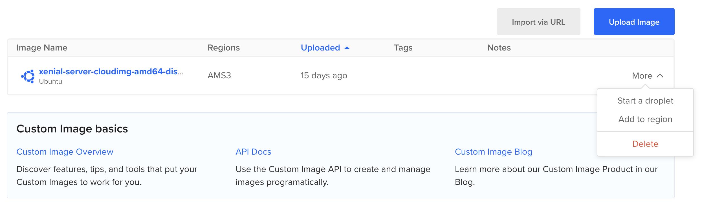
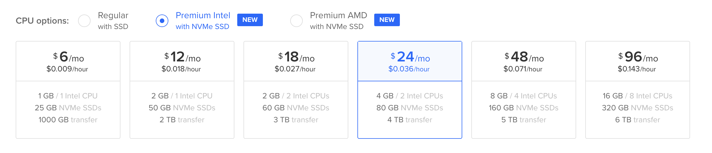

# Deploying an Indy Node for DTN

> Deploying a node for DTN is currently only possible for DTN members.

> TODO: This guide doesn't follow all best practices with regards to deploying an Indy node. For the test network this is fine, but for the main network we should adopt best practices. Indicio has very extensive documentation on securely deploying a node: https://docs.google.com/document/d/1y0rW78_I-bRkH3qFN5kcP58jJH23Zahc363h18SmJ48, on which some parts of this document are based.

## 1. Server Requirements

- Ubuntu 16.04
- 1 CPU
- 4GB Memory
- 30GB+ Storage
- Ports `9701` and `9702` exposed
- Static IP address

See [Setting Up Digital Ocean for Node](#appendix-a-setting-up-digital-ocean-server) for information on how to set up an Ubuntu 16.04 server for deploying a DTN node.

### 1.1 Creating the Indy user

Before setting up the validator node we need to make sure we create an `indy` non-root sudo user without password.

1. Login to the server as the root user

   1. `ssh root@<server-public-ip>`

2. `sudo adduser indy`
3. `sudo usermod -aG sudo indy`
4. `sudo mkdir /home/indy/.ssh `
5. `sudo chown indy:indy /home/indy/.ssh`
6. `sudo vim /home/indy/.ssh/authorized_keys`
7. Paste the public keys that should have access to this user and save it (`:wq`)
8. `sudo chown indy:indy /home/indy/.ssh/authorized_keys`
9. Open the sudo config file `sudo visudo ` and add the following line to the end of the file
   - `indy ALL=(ALL) NOPASSWD:ALL`

## 2. Node Prerequisites

Before you start this process, you’ll need to have a place where you can store all of the following information. Some of these items need to be **KEPT SAFE AND SECURE**.

- Your Steward key seed
  - This is extremely important and it must be kept **safe and private**. It is used to generate the public / private key pair that you will use as a Node Operator to post transactions to the ledger.
  - The steward key seed can be generated using the `pwgen` command
    - `pwgen -s 32 1` (`sudo apt install pwgen` if not installed)
- Your Steward wallet key
  - The steward wallet key can be generated using the `pwgen` command
    - `pwgen -s 32 1` (`sudo apt install pwgen` if not installed)
- Your Steward Decentralized identifier (DID)
  - This is public information that is generated by your Node Operator key seed. It is an identifier for your organization that will be written to the ledger by a DTN Trustee.
- Your Steward verification key (verkey)
  - This is public information that is generated by your Node Operator key seed. It will be written to the ledger by a DTN trustee along with your DID, and will be used to verify transactions that you write to the ledger
- The Validator IP Address for inter-node communications
  - This IP address must be configured for exclusive use of inter-node consensus traffic. Ideally, traffic to this address will be whitelisted in your firewall.
- The Validator node port
- The Validator IP Address for client connections
  - This IP address must be open for connections from anywhere, since clients around the world will need to be able to connect to your node freely.
- The Validator client port
- The Validator alias
- The Validator node seed
  - This is distinct from your Node Operator seed, and will generate public and private keys that your Validator will use for communications with other Validators. Like the Node Operator seed, it should be **kept secure**.
  - The steward key seed can be generated using the `pwgen` command
    - `pwgen -s 32 1` (`sudo apt install pwgen` if not installed)
- The Validator Node Identifier
  - This is distinct from your Steward verkey. It is also public information that will be placed on the ledger, but is used as a public key by your Validator node, rather than by you, the Node Operator.
- The Validator BLS public key.
  - Used by the Validator to sign individual transactions that will be committed to the ledger. It is public information that will be written to the ledger.
- The Validator BLS key proof-of-possession (pop)
  - A cryptographic check against certain forgeries that can be done with BLS keys.

## 3. Setting up the Node

### 3.1 Installing the Node

1. Sign in as the root user on the server
   - `ssh root@<server-public-ip>`
2. Run the following commands
   - `apt-key adv --keyserver keyserver.ubuntu.com --recv-keys 68DB5E88`
   - `echo "deb https://repo.sovrin.org/deb xenial stable" >> /etc/apt/sources.list`
   - `apt-get update -y && sudo apt-get install -y indy-node libsodium18`
   - `apt-key adv --keyserver keyserver.ubuntu.com --recv-keys CE7709D068DB5E88`
   - `add-apt-repository "deb https://repo.sovrin.org/sdk/deb xenial stable”`
   - `apt update -y`
   - `apt install indy-cli`
   - `rm -r /etc/indy /var/lib/indy`
   - `exit`
3. Sign in as the indy user on the server
   - `ssh indy@<server-public-ip>`
4. Run the following commands
   - `create_dirs.sh`
   - `vim /etc/indy/indy_config.py`
     - Update the `NETWORK_NAME` to `NETWORK_NAME = “dtnnetwork”`
   - `init_indy_keys --name <alias> --seed <seed>`
     - Replace `<seed>` with the the Validator node seed generated in section 2.
     - Replace `<alias>` with the Validator alias
     - **Store the output of the command. The seed in the output should be protected from disclosure**
   - `vim /var/lib/indy/dtnnetwork/domain_transactions_genesis`
     - Paste the contents of https://github.com/dutch-trust-network/dutch-trust-network/blob/main/genesis-files/domain_transactions_genesis
   - `vim /var/lib/indy/dtnnetwork/pool_transactions_genesis`
     - Paste the contents of https://github.com/dutch-trust-network/dutch-trust-network/blob/main/genesis-files/pool_transactions_genesis
5. Start the indy cli (by running `indy-cli`) and execute the following commands
   - `wallet create <name> key=<steward-wallet-key>`
     - Replace `<name>` with any name, make sure to write down
     - Replace `<steward-wallet-key>` with the Steward wallet key generated in section 2.
   - `wallet open <name> key=<steward-wallet-key>`
   - `pool create dtn gen_txn_file=/var/lib/indy/dtnnetwork/pool_transactions_genesis`
   - `pool connect dtn`
   - `did new seed=<steward-key-seed>`
     - Replace `<steward-key-seed>` with the Steward key seed generated in section 2.
     - **Store the output of the command. The did and verkey are your steward did and verkey**

### 3.2 Registering the Steward Did

> TODO: Who is responsible for adding the steward did to the ledger?

> IMPORTANT: DO NOT proceed further with this document until your did and verkey (the public key) are on the ledger.

Before we can start the node we need to make sure the steward did is registered on the ledger. Provide a DTN trustee with your steward did and verkey (generated in the last command from the previous section). You will receive notification when your did and verkey have been added to the ledger.

### 3.3 Add Validator Node to the Ledger

Once the steward did has been added to the ledger we can add the validator node to the ledger and start the node.

1. Sign in as the indy user on the server
   - `ssh indy@<server-public-ip>`
2. Start the indy cli (by running `indy-cli`) and execute the following commands
   - `wallet create <name> key=<steward-wallet-key>`
   - `wallet open <name> key=<steward-wallet-key>`
     - Replace `<name>` and `<steward-wallet-key>` with the values used when the wallet was created
   - `pool connect dtn`
   - `did use <steward-did>`
     - Replace `<steward-did>` with the steward did
   - `ledger node target=<validator-verkey> node_ip=<node-public-ip> node_port=9701 client_ip=<node-public-ip> client_port=9702 alias=<validator-alias> services=VALIDATOR blskey=<bls-public-key> blskey_pop=<bls-proof-of-possesion>`
     - Replace `<validator-verkey>` with the value of `Verification key is <validator-verkey>` from the `init_indy_keys` command
     - Replace `<node-public-id>` with the public ip of the node
     - Replace `<validator-alias>` with the value of `Node-stack name is <validator-alias>` from the `init_indy_keys` command
     - Replace `<bls-public-key>` with the value of `BLS Public key is <bls-public-key>` from the `init_indy_keys` command
     - Replace `<bls-proof-of-possesion>` with the value of `Proof of possession for BLS key is <bls-proof-of-possesion>` from the `init_indy_keys` command
   - `exit` - to exit from the indy-cli
3. Run the following commands to start the node
   - `vim /etc/indy/indy.env`
     - Paste the contents of the Indy Environment File in section 3.5.1
   - `vim /etc/indy/node_control.conf`
     - Paste the contents of the Indy Node Control Configuration file in section 3.5.2
   - `vim /etc/systemd/system/indy-node.service`
     - Change the `User` and `Group` to the ssh username.
     - This is only needed if you don’t use the `indy` user as described in section 1.1 (default is `indy`)
   - `sudo systemctl enable indy-node-control.service`
   - `sudo systemctl start indy-node-control.service`
   - `sudo systemctl enable indy-node.service`
   - `sudo systemctl start indy-node.service`

### 3.4 Verifying if the Node is setup successfully

1. Check if the log file exists
   - `cat /var/log/indy/dtnnetwork/<validator-alias>.log`
     - Replace `<validator-alias>` with the value of `Node-stack name is <validator-alias>` from the `init_indy_keys` command
     - Make sure to check for the `connections changed from` and `updated validators list to` lines (using e.g. grep)
2. Check the status of the validator node
   - `sudo validator-info`
   - You should see your node as part of the `Reachable Hosts`
3. Get the updated pool genesis transactions file
   - `read_ledger --type pool`

### 3.5 Files

#### 3.5.1 Indy Environment File

Should be placed in `/etc/indy/indy.env`. Replace `<validator-alias>` with the value of `Node-stack name is <validator-alias>` from the `init_indy_keys` command.

```
NODE_NAME=<validator-alias>
NODE_IP=0.0.0.0
NODE_PORT=9701
NODE_CLIENT_IP=0.0.0.0
NODE_CLIENT_PORT=9702
```

#### 3.5.2 Indy Node Control Configuration

Should be placed in `/etc/indy/node_control.conf`.

```
# Uncomment this to run agent in test mode:
#TEST_MODE=--test

TEST_MODE=
HOLD_EXT=sovtoken sovtokenfees sovrin
```

k## Appendix A. Setting Up Digital Ocean Server

Digital Ocean doesn't support Ubuntu 16.04 anymore, so we need to provide our own base image. The following steps are required to set up a Digital Ocean server.

1. Download the [current Ubuntu 16.04 image](https://cloud-images.ubuntu.com/xenial/current/xenial-server-cloudimg-amd64-disk1.img) from the Ubuntu cloud images sites
2. Upload the image to your Digital Ocean account [here](https://cloud.digitalocean.com/images/custom_images)
3. Click the create a droplet button (Green `CREATE` button at top of page)
4. Click on `More` for the image you just uploaded, and click `Create Droplet`
   
5. For the server specs make sure to at minimum use the following plan
   
6. Make sure to add an SSH key so you can get access to the droplet, add one if you don't have keys stored in Digital Ocean already
7. Create the droplet! Once finished you can proceed with the rest of the setup guide.
