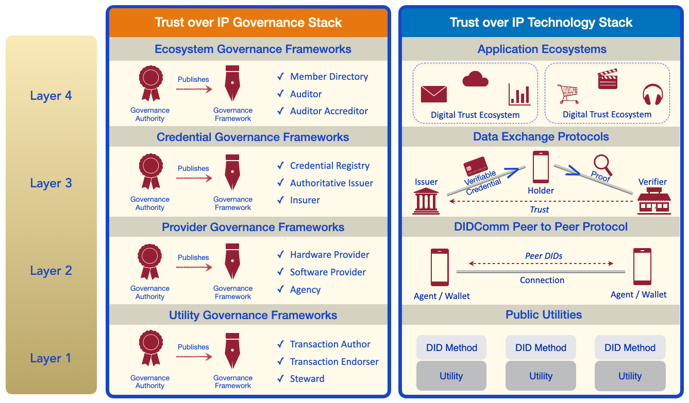

# DTN Trust Over IP Stack

For DTN members to be able to communicate and interoperate with each other we need to adhere to certain standards. This document focusses on the technical side of the DTN stack in accordance with the [Trust Over IP Stack](https://github.com/hyperledger/aries-rfcs/blob/main/concepts/0289-toip-stack/README.md).

# Layer 1

Layer 1 of the ToIP stack focuses on the network or blockchain being used. DTN uses a custom [Hyperledger Indy](https://github.com/hyperledger/indy-node) network. All members of DTN are expected to run a node in the DTN.

More information on how to set-up a DTN node can be found in the [Deploying an Indy Node for DTN](deploying-dtn-node.md) guide.

# Layer 2

> TODO: For now made the assumption we will use DIDComm v1 (which makes the most sense at the moment)

Layer 2 of the ToIP stack focusses on the communication between entities. DTN makes use of [DIDComm](https://github.com/hyperledger/aries-rfcs/blob/main/concepts/0005-didcomm/README.md) for secure messaging between agents. All members of DTN are expected to support at least DIDComm v1 for communicating with other DTN members.

# Layer 3

> TODO: For now made the assumption we will use AIP 1.0. I think this still makes the most sense at the moment, but it would be good to move to AIP 2.0 as soon as possible to not be stuck in AIP 1 forever.

Layer 3 of the ToIP stack focusses on data exchange protocols and the exchange of verifiable credentials. DTN makes use of the protocols defined in [Aries Interop Profile 1.0](https://github.com/hyperledger/aries-rfcs/blob/main/concepts/0302-aries-interop-profile/README.md#aries-interop-profile-version-10) for exchanging verifiable credentials. All members of DTN are expected to support at least AIP 1.0 for exchanging verifiable credentials, specifically [RFC 0160: Connection Protocol](https://github.com/hyperledger/aries-rfcs/tree/9b0aaa39df7e8bd434126c4b33c097aae78d65bf/features/0160-connection-protocol), [RFC 0036: Issue Credential Protocol 1.0](https://github.com/hyperledger/aries-rfcs/tree/bb42a6c35e0d5543718fb36dd099551ab192f7b0/features/0036-issue-credential) and [RFC 0037: Present Proof Protocol 1.0](https://github.com/hyperledger/aries-rfcs/tree/4fae574c03f9f1013db30bf2c0c676b1122f7149/features/0037-present-proof) must be supported.

# Layer 4

> TODO: Not sure we need to define anything on Layer 4 at the moment.
